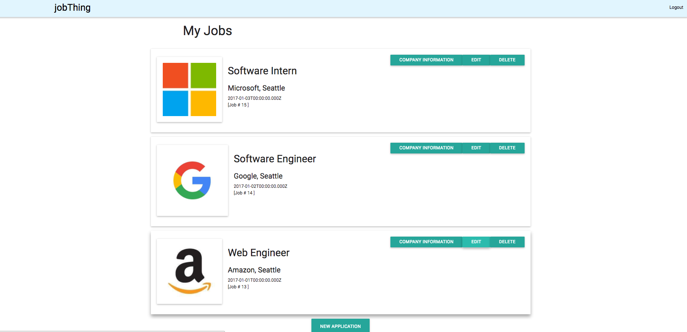

# jobThing

jobThing was a collaborative project built by Karl Watson and Krsto Culafic in October 2016. This project was built in four days.

jobThing is a full-stack web interface to help visually track job applications. Users can sign up for an account and begin logging their applications. For each job submitted, jobThing creates a card with the job title, company, and location. Users can click on each Company Information button to reveal Company Ratings and a Featured Review (courtesy of the Glassdoor API).

Technologies used: Node.js, PostgreSQL, Express, Knex, JS/HTML/CSS, Materialize, and jQuery.

 
